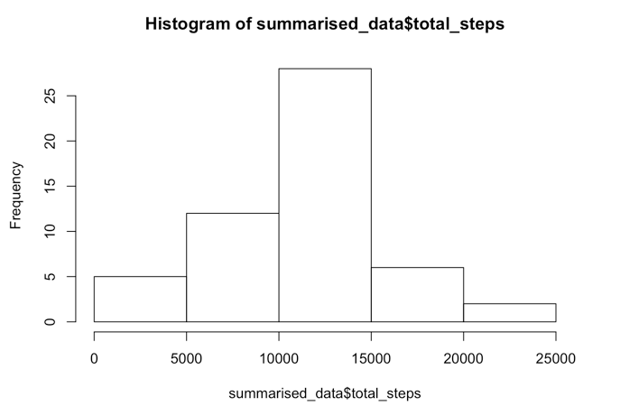
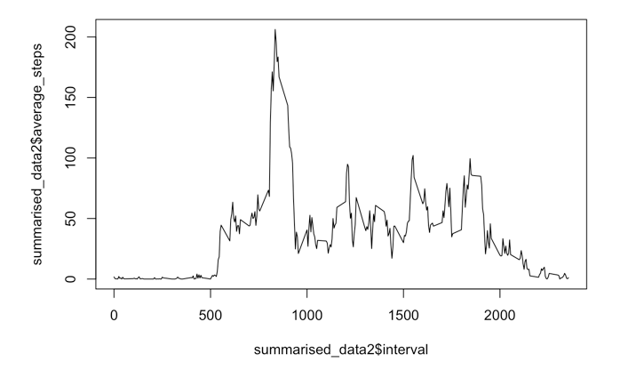
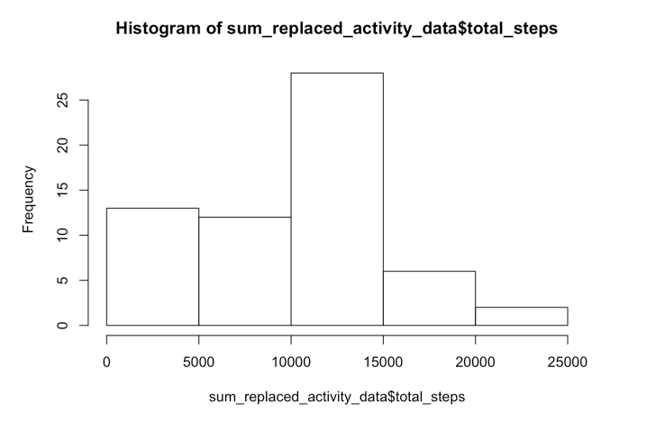
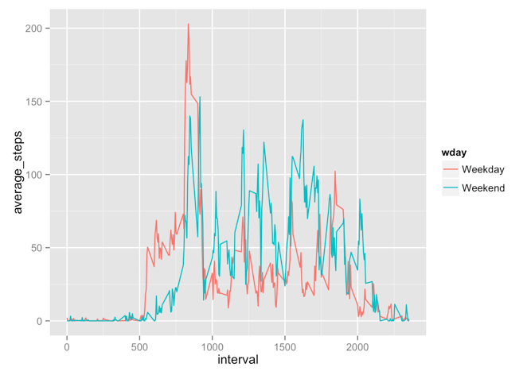

Assessing Activity Monitoring Data
==================================

This is a markdown file to assess some activity data.  

###Here is part 1 - Loading/Processing:

Here, we're going to load some data, and convert the date column into a date class:  


```r
activity_data <- read.csv("activity.csv")
activity_data$date <- as.Date(activity_data$date)
```

###Here is part 2 - Mean Steps per Day:

Next, we are going to take the mean number of steps per day. We are first going to remove empty data and then calculate daily averages. 


```r
complete_activity_data <- activity_data[complete.cases(activity_data),]
library(plyr)
summarised_data <- ddply(complete_activity_data, "date", summarise, total_steps = sum(steps))
```

Here are the daily totals of steps:

```r
summarised_data
```

```
##          date total_steps
## 1  2012-10-02         126
## 2  2012-10-03       11352
## 3  2012-10-04       12116
## 4  2012-10-05       13294
## 5  2012-10-06       15420
## 6  2012-10-07       11015
## 7  2012-10-09       12811
## 8  2012-10-10        9900
## 9  2012-10-11       10304
## 10 2012-10-12       17382
## 11 2012-10-13       12426
## 12 2012-10-14       15098
## 13 2012-10-15       10139
## 14 2012-10-16       15084
## 15 2012-10-17       13452
## 16 2012-10-18       10056
## 17 2012-10-19       11829
## 18 2012-10-20       10395
## 19 2012-10-21        8821
## 20 2012-10-22       13460
## 21 2012-10-23        8918
## 22 2012-10-24        8355
## 23 2012-10-25        2492
## 24 2012-10-26        6778
## 25 2012-10-27       10119
## 26 2012-10-28       11458
## 27 2012-10-29        5018
## 28 2012-10-30        9819
## 29 2012-10-31       15414
## 30 2012-11-02       10600
## 31 2012-11-03       10571
## 32 2012-11-05       10439
## 33 2012-11-06        8334
## 34 2012-11-07       12883
## 35 2012-11-08        3219
## 36 2012-11-11       12608
## 37 2012-11-12       10765
## 38 2012-11-13        7336
## 39 2012-11-15          41
## 40 2012-11-16        5441
## 41 2012-11-17       14339
## 42 2012-11-18       15110
## 43 2012-11-19        8841
## 44 2012-11-20        4472
## 45 2012-11-21       12787
## 46 2012-11-22       20427
## 47 2012-11-23       21194
## 48 2012-11-24       14478
## 49 2012-11-25       11834
## 50 2012-11-26       11162
## 51 2012-11-27       13646
## 52 2012-11-28       10183
## 53 2012-11-29        7047
```
Here is a histogram of the daily steps:

```r
hist_steps <- hist(summarised_data$total_steps)
```

 

Here are the mean and medeian of the steps/day:

```r
mean(summarised_data$total_steps)
```

```
## [1] 10766.19
```

```r
median(summarised_data$total_steps)
```

```
## [1] 10765
```

###Here is part 3 - Average Daily Activity Pattern:


We are now going to take the average steps per time interval, and then plot it. 


```r
summarised_data2 <- ddply(complete_activity_data, "interval", summarise, average_steps = mean(steps))

plot(summarised_data2$interval, summarised_data2$average_steps, type = "l")
```

 

The time interval 835 has the highest average steps at 206.17. 

###Here is part 4 - Inputing Missing Values:

Here are the number of fields with missing data points:

```r
nrow(activity_data[!complete.cases(activity_data),])
```

```
## [1] 2304
```

To replace missing data, we are going to fill the NA's with 0's, and recreate a histogram of total steps taken each day: 


```r
replaced_activity_data <- activity_data
replaced_activity_data[is.na(replaced_activity_data)] <- 0
sum_replaced_activity_data <- ddply(replaced_activity_data, "date", summarise, total_steps = sum(steps))
new_hist_steps <- hist(sum_replaced_activity_data$total_steps)
```

 


Here are the mean and medeian of the steps/day:

```r
mean(sum_replaced_activity_data$total_steps)
```

```
## [1] 9354.23
```

```r
median(sum_replaced_activity_data$total_steps)
```

```
## [1] 10395
```

Overall, both the mean and the median were dragged down because of the increased amount of time intervals with 0 steps
which were added in to clean the data.


###Here is part 5 - Weekdays/Weekends

We are going to add in a column of data indicating if the date is a weekday or part of the weekend. 

```r
weekday_list <- c("Monday", "Tuesday", "Wednesday", "Thursday", "Friday")
a <- factor((weekdays(replaced_activity_data$date) %in% weekday_list), levels=c(TRUE, FALSE), labels=c('Weekday', 'Weekend'))

replaced_activity_data$wday <- a

head(replaced_activity_data, n = 15)
```

```
##    steps       date interval    wday
## 1      0 2012-10-01        0 Weekday
## 2      0 2012-10-01        5 Weekday
## 3      0 2012-10-01       10 Weekday
## 4      0 2012-10-01       15 Weekday
## 5      0 2012-10-01       20 Weekday
## 6      0 2012-10-01       25 Weekday
## 7      0 2012-10-01       30 Weekday
## 8      0 2012-10-01       35 Weekday
## 9      0 2012-10-01       40 Weekday
## 10     0 2012-10-01       45 Weekday
## 11     0 2012-10-01       50 Weekday
## 12     0 2012-10-01       55 Weekday
## 13     0 2012-10-01      100 Weekday
## 14     0 2012-10-01      105 Weekday
## 15     0 2012-10-01      110 Weekday
```

We are now going to plot the average steps by Weekday and Weekend. 


```r
library(ggplot2)

summarised_data3 <- ddply(replaced_activity_data, c("wday", "interval"), summarise, average_steps = mean(steps))

ggplot(data=summarised_data3, aes(x=interval, y=average_steps, colour=wday)) + geom_line()
```

 


